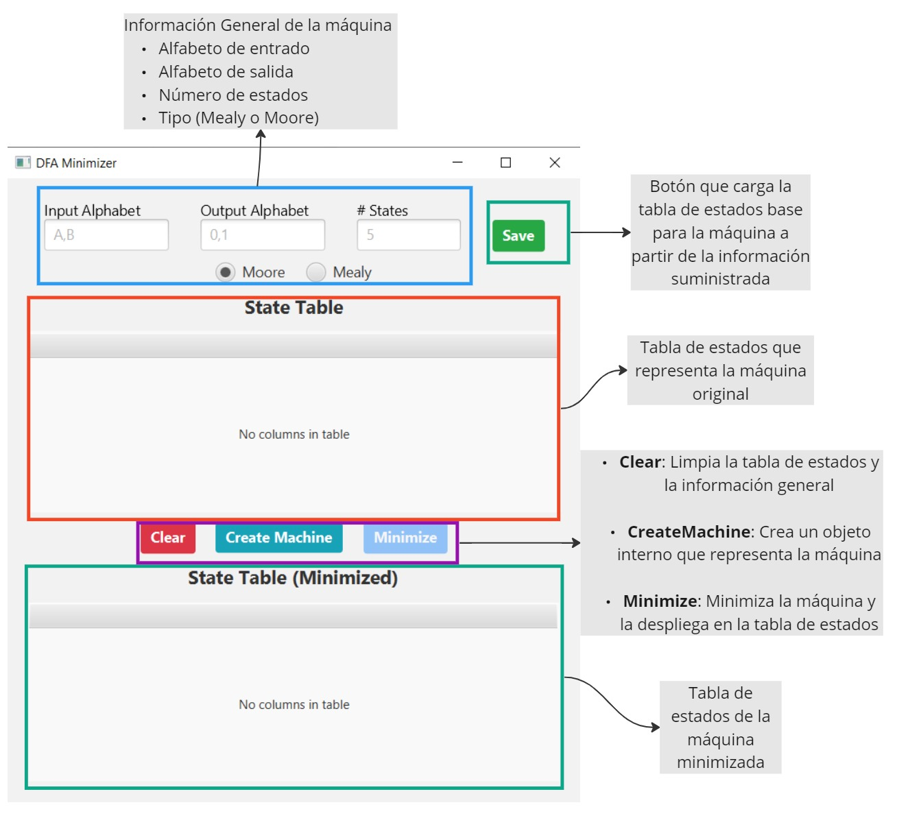
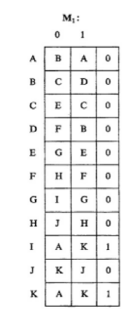
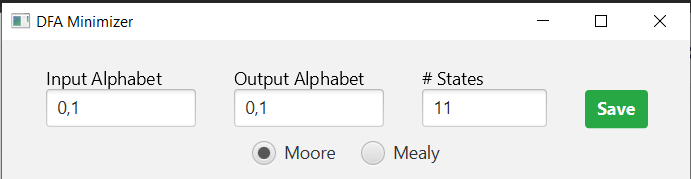
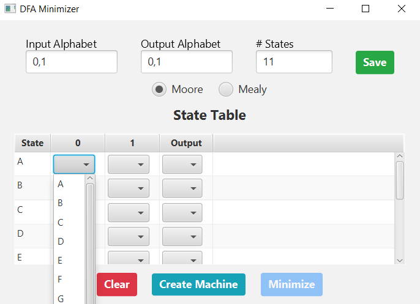
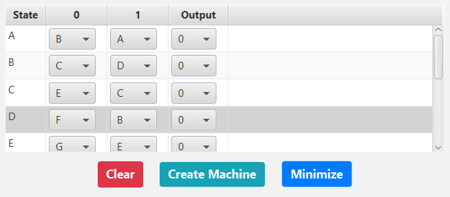
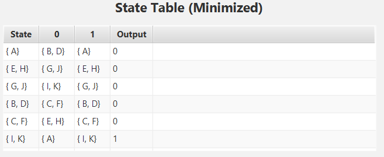
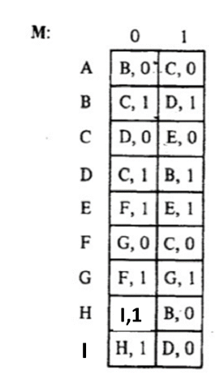
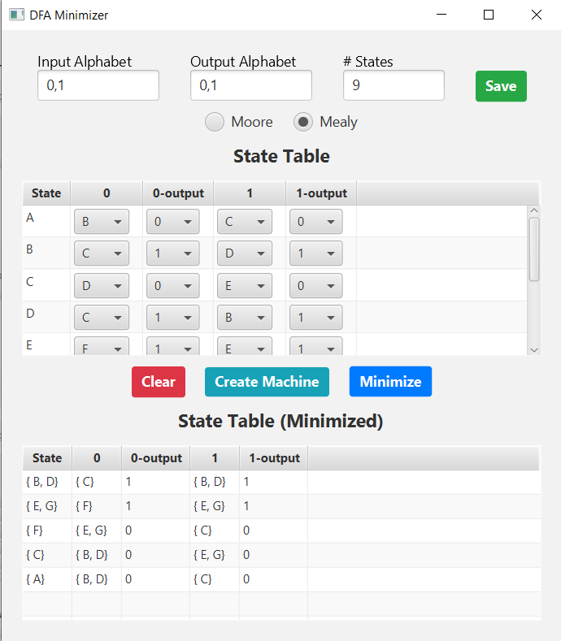

# DFA-minimization

## Vistazo general de la aplicación

## Minimizar una máquina

### Máquina de Moore

Partiendo de una máquina con los siguientes estados:

En el programa se introduce la información general de la máquina y se selecciona el tipo de máquina (Moore) en este ejemplo:
- Alfabeto de entrada {0,1} 
- Alfabeto de salida {0,1}
- Número de estados: 11

Tras dar click al botón "Save" de color verde, en la primera tabla "State Table" se crean 11 estados identificados con una letra mayuscula. El estado inicial corresponde al estado A. Así mismo se muestran las casillas que permiten ingresar las transiciones de acuerdo las valores de entrada, y las salidas correspondientes a cada estado. Para cada caso hay disponible un menú desplegable que permite seleccionar el estado de la transición y el valor de la salida.

Agregando la información de la máquina se llena la tabla. Una vez llena se da click al botón "Crear Máquina", así se habilita el botón minimizar.

Tras dar click en minimizar se realiza el algoritmo de minimización y se muestra su resultado en la tabla "State Table (Minimized)". El nombre de cada estado corresponde a las agrupaciones realizadas en el algoritmo de minimización, y así mismo se ajustan las transiciones y la salida. El estado inicial será aquel que tenga el estado A.

### Máquina de Mealy

Máquina de ejemplo:

Siguiendo los pasos para la máquina de Moore tambien se llega a la máquina de Mealy con la diferencia de que cada transición tiene asociado un valor de salida, y los estados carecen de una salida en si mismos.

